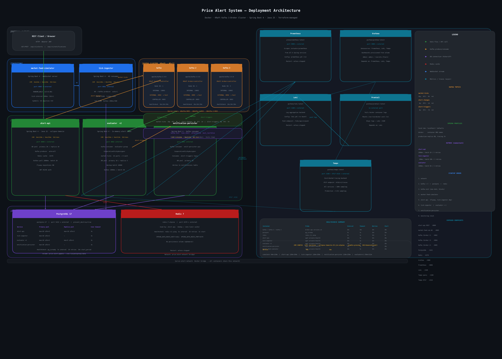

# Price Alert System

[](https://sonarcloud.io/summary/new_code?id=price-alert)
[](https://deepwiki.com/Puneethkumarck/price-alert)

[](https://openjdk.org/)
[](https://spring.io/projects/spring-boot)
[](https://kafka.apache.org/)
[](https://www.postgresql.org/)
[](https://redis.io/)
[](https://github.com/namastack/namastack-outbox)
[](https://testcontainers.com/)
[](https://www.terraform.io/)
[](https://grafana.com/)
[](LICENSE)

Real-time price alerting for US equities: create alerts (e.g. *“Notify me when AAPL goes above $150”*), and get persisted notifications when live market ticks cross your thresholds. Built as a production-ready Spring Boot microservice system with Kafka, PostgreSQL, Redis, transactional outbox, multi-layer deduplication, and full observability.

---

## Table of Contents

| Section | Contents |
|--------|----------|
| **Get started** | [Prerequisites](#prerequisites) · [Quick start](#quick-start) |
| **Project at a glance** | [Features](#features) · [Tech stack](#tech-stack) · [Project structure](#project-structure) · [Architecture](#architecture) |
| **Run & use** | [Configuration](#configuration) · [Endpoints](#endpoints) · [Authentication](#authentication) · [Observability](#observability) |
| **Development** | [Testing](#testing) · [Documentation](#documentation) |
| **Reference** | [Contributing](#contributing) · [Security](#security) · [License](#license) |

---

## Prerequisites

- **Docker** and **Docker Compose**
- **Java 25** (for local Gradle build; optional if you only run via Docker)

---

## Quick Start

From the project root:

```bash
./scripts/launch.sh up
```

This builds all services, starts the stack (Kafka, PostgreSQL, Redis, five app services, monitoring), and waits for health checks. When ready:

```bash
./scripts/launch.sh test
```

Runs the happy-path E2E test against the running stack. To tear down:

```bash
./scripts/launch.sh down
```

**Other commands**

| Command | Description |
|--------|-------------|
| `./scripts/launch.sh status` | Service status and ports |
| `./scripts/launch.sh logs` | Tail all service logs |
| `./scripts/launch.sh restart` | Restart without rebuild |
| `./scripts/launch.sh clean` | Stop, remove volumes, prune images |
| `./scripts/launch.sh up --skip-build` | Start using existing JARs |
| `./scripts/launch.sh up --skip-tests` | Build without running unit tests |

---

## Features

| Area | Description |
|------|-------------|
| **Transactional outbox** | Alert, tick, and trigger events are published only after DB commit for reliable, at-least-once delivery. |
| **In-memory alert index** | Lock-free, symbol-partitioned evaluation for high throughput and horizontal scaling of evaluators. |
| **4-layer deduplication** | Idempotent notification persistence via trigger log, unique constraints, Redis, and in-memory checks. |
| **Observability** | Metrics (Prometheus), logs (Loki), traces (Tempo), and pre-built Grafana dashboards out of the box. |
| **Auth & rate limiting** | JWT Bearer tokens with Redis blacklist and per-user rate limits (e.g. 10 alert creates/min). |

---

## Tech Stack

| Layer | Technologies |
|-------|----------------|
| **Runtime** | Java 25, Spring Boot 4.0.3, Gradle 9.x |
| **Data & messaging** | PostgreSQL 17, Redis 7, Apache Kafka 3.9 (KRaft) |
| **Libraries** | Lombok 1.18.42, MapStruct 1.6.3, namastack-outbox 1.0.0, Flyway 11.x |
| **Observability** | Micrometer (Prometheus + OpenTelemetry), Grafana, Loki, Tempo |
| **Testing** | JUnit 5, ArchUnit 1.3.2, Testcontainers 1.21.3 |

---

## Project Structure

| Path | Role |
|------|------|
| `alert-api/` | REST API for alerts and notifications (JWT, rate limiting, outbox) |
| `market-feed-simulator/` | WebSocket server emitting simulated price ticks (50 US equities) |
| `tick-ingestor/` | Consumes WebSocket ticks and publishes to Kafka via outbox |
| `evaluator/` | In-memory alert index; evaluates ticks and emits triggers via outbox |
| `notification-persister/` | Consumes triggers and persists notifications with deduplication |
| `common/` | Shared DTOs, events, and utilities |
| `monitoring/` | Grafana, Prometheus, Loki, Tempo configuration |
| `infra/` | Terraform and infrastructure assets |
| `docs/` | Architecture and operational guides |
| `scripts/` | Launch and E2E script (`launch.sh`) |

---

## Architecture

Data flows from the market feed (simulator) through the tick-ingestor into Kafka; the evaluator consumes ticks and alert lifecycle events, evaluates thresholds, and publishes triggers; the notification-persister writes notifications and trigger logs. All event publishing uses a transactional outbox for reliability.



**Application services**

| Service | Port | Responsibility |
|--------|------|----------------|
| **alert-api** | 8080 | REST CRUD for alerts and notifications; JWT auth, rate limiting, outbox for alert lifecycle |
| **market-feed-simulator** | 8085 | Simulated price ticks over WebSocket (50 US equities) |
| **tick-ingestor** | 8081 | WebSocket → Kafka via outbox |
| **evaluator** | 8082 | In-memory alert index; evaluates ticks, emits triggers via outbox |
| **notification-persister** | 8083 | Persists notifications with 4-layer deduplication |

**Infrastructure**

- **Kafka** — 3-broker KRaft cluster; topics: `market-ticks`, `alert-changes`, `alert-triggers`
- **PostgreSQL 17** — Alerts, notifications, trigger logs, outbox tables; Flyway migrations
- **Redis 7** — Rate limiting and JWT blacklist
- **Monitoring** — Prometheus, Grafana, Loki, Tempo (OTLP)

Full data flow and design: [docs/OVERVIEW.md](docs/OVERVIEW.md).

---

## Configuration

Defaults live in `docker-compose.yml`. Override for production (secrets, URLs, etc.).

| Setting | Default |
|--------|--------|
| Kafka bootstrap | `kafka:19092,kafka-2:19092,kafka-3:19092` |
| PostgreSQL | `jdbc:postgresql://postgres:5432/price_alerts` (user: `alerts`, password: `alerts_local`) |
| Redis | `redis:6379` |
| JWT secret | `JWT_SECRET=price-alert-dev-secret-key-change-in-production` — **change in production** |

---

## Endpoints

| Resource | URL |
|----------|-----|
| Alerts API | http://localhost:8080/api/v1/alerts |
| Notifications API | http://localhost:8080/api/v1/notifications |
| Health | http://localhost:8080/actuator/health |
| Market feed (WebSocket) | ws://localhost:8085/v1/feed |
| Grafana | http://localhost:3000 (admin / admin) |
| Prometheus | http://localhost:9090 |
| Loki | http://localhost:3100 |
| Tempo | http://localhost:3200 |

---

## Authentication

The API expects a Bearer token signed with `JWT_SECRET` (see [Configuration](#configuration)).

**Generate a dev token (bash):**

```bash
SECRET="price-alert-dev-secret-key-change-in-production"
HEADER=$(echo -n '{"alg":"HS256","typ":"JWT"}' | base64 | tr -d '=' | tr '/+' '_-')
PAYLOAD=$(echo -n '{"sub":"user_001","iat":1700000000,"exp":9999999999}' | base64 | tr -d '=' | tr '/+' '_-')
SIG=$(echo -n "${HEADER}.${PAYLOAD}" | openssl dgst -sha256 -hmac "${SECRET}" -binary | base64 | tr -d '=' | tr '/+' '_-')
TOKEN="${HEADER}.${PAYLOAD}.${SIG}"
```

**Example: create an alert**

```bash
curl -X POST http://localhost:8080/api/v1/alerts \
  -H "Authorization: Bearer $TOKEN" \
  -H "Content-Type: application/json" \
  -d '{"symbol":"AAPL","thresholdPrice":150.00,"direction":"ABOVE","note":"test"}'
```

---

## Observability

- **Prometheus** — Scrapes `/actuator/prometheus` on all services.
- **Grafana** — Pre-provisioned dashboards and datasources (Prometheus, Loki, Tempo).
- **Loki** — Centralized logs via Promtail; trace IDs link to Tempo.
- **Tempo** — OpenTelemetry OTLP traces.

See [docs/OVERVIEW.md](docs/OVERVIEW.md) and [docs/METRICS_REFERENCE.md](docs/METRICS_REFERENCE.md); config in `monitoring/`.

---

## Testing

| Kind | Command | Requires |
|------|--------|----------|
| Unit | `./gradlew :evaluator:test :alert-api:test` | — |
| Architecture (ArchUnit) | `./gradlew :alert-api:test --tests "*ArchitectureTest"` (and evaluator, notification-persister) | — |
| Integration | `./gradlew :alert-api:test` | Docker (Testcontainers) |
| E2E | `./scripts/launch.sh test` | Full stack running |

Full guide: [docs/TESTING.md](docs/TESTING.md).

---

## Documentation

| Topic | Document |
|-------|----------|
| Architecture & data flow | [OVERVIEW.md](docs/OVERVIEW.md) |
| Evaluator internals | [EVALUATION_ENGINE.md](docs/EVALUATION_ENGINE.md) |
| Performance & scaling | [PERFORMANCE_AND_SCALABILITY.md](docs/PERFORMANCE_AND_SCALABILITY.md) |
| Load testing | [PERFORMANCE_TESTING_GUIDE.md](docs/PERFORMANCE_TESTING_GUIDE.md) |
| Testing | [TESTING.md](docs/TESTING.md) |
| Troubleshooting | [TROUBLESHOOTING.md](docs/TROUBLESHOOTING.md) |
| Metrics | [METRICS_REFERENCE.md](docs/METRICS_REFERENCE.md) |
| Data flow diagram | [dataflow.html](docs/dataflow.html) |

---

## Contributing

1. Open an issue for bugs or feature requests.
2. Fork, create a branch, and run `./gradlew build`.
3. Follow existing style (Spotless / Google Java Format).
4. Open a pull request with a clear description.

---

## Security

- **Secrets** — Do not commit production secrets. Use environment variables or a secret manager for `JWT_SECRET` and DB credentials.
- **Vulnerabilities** — Report privately (e.g. GitHub Security Advisories or maintainer contact). Do not open public issues.

---

## License

See the [LICENSE](LICENSE) file in this repository. If none is present, all rights are reserved.
